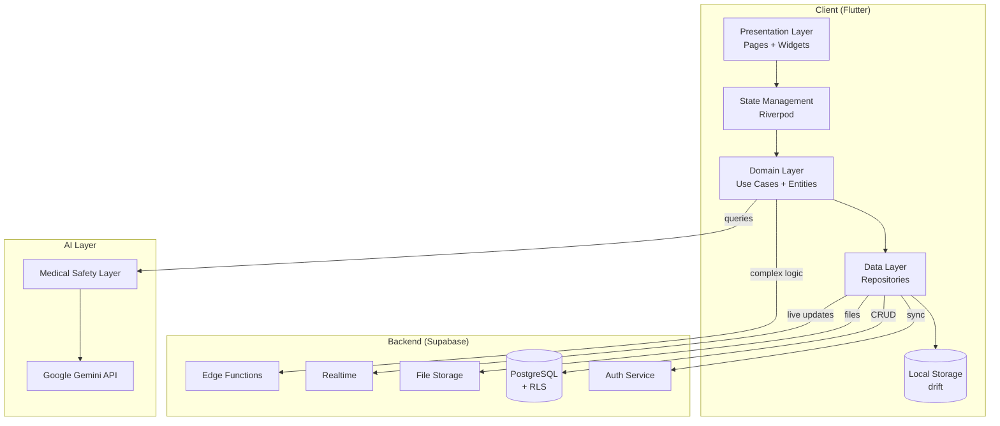

# 🌸 BloomBelly

### AI-assisted, Arabic-first maternal & child health companion

*Bridging the digital health gap in Arabic-speaking regions — from the first heartbeat to the first step.*

---

> [!NOTE]
> **This is a showcase repository.** The source code is private and proprietary. This repository contains documentation, screenshots, architecture diagrams, and demo links to illustrate the project. For inquiries about partnerships, licensing, or technical details, please contact me directly.

---

## 📖 The Problem

Maternal and child mortality in Arabic-speaking countries remains among the highest in the world. Most digital health solutions are English-first, generic, and disconnected from the cultural and linguistic context of MENA mothers. Rural and underserved regions lack offline-capable, evidence-based companions for the journey from pregnancy to early childhood.

**Key gaps BloomBelly addresses:**
- Arabic-language clinical content with proper RTL design
- Offline-first architecture for low-bandwidth regions
- AI-assisted answers grounded in WHO/ACOG/CDC guidelines
- Continuous care from pregnancy through early childhood in **one** app

---

## ✨ The Solution

BloomBelly is a comprehensive Flutter application that follows a mother's journey from pregnancy planning through her child's early years, combining:

- 🤰 **Pregnancy tracking** — journal, kick counter, weight, symptoms, growth
- 👶 **Child care** — multi-child profiles, vaccinations, sleep, nutrition, growth charts
- 🩺 **Health monitoring** — lab results tracker, first-aid guide, symptom checker
- 🤖 **AI companion** — Arabic-native medical Q&A with safety guardrails
- 📊 **Visual insights** — interactive charts powered by `fl_chart`
- 🔐 **Privacy by design** — Row-Level Security at the database layer

---

## 🎯 Key Features

<table>
<tr>
<td width="50%">

### Pregnancy Module
- 📓 Daily journal with photo attachments
- 👣 Kick counter with ACOG-aligned analysis
- ⚖️ Weight tracking with healthy-range alerts
- 🩹 Symptom logger with red-flag detection

</td>
<td width="50%">

### Child Module
- 🧒 Multiple child profiles
- 💉 Vaccination schedule (WHO-aligned)
- 😴 Sleep pattern tracking
- 🍼 Nutrition log
- 📈 Growth curves (WHO standards)

</td>
</tr>
<tr>
<td width="50%">

### AI Assistant
- 💬 Conversational interface in Arabic
- 🛡️ Medical safety layer (in development)
- 📚 Cited responses (WHO, Mayo Clinic)
- 🚨 Emergency-keyword triage

</td>
<td width="50%">

### Platform
- 🌐 Bilingual (Arabic / English)
- 📴 Offline-first (in development)
- 🔄 Real-time sync via Supabase
- 🍎 Sign in with Apple

</td>
</tr>
</table>

---

## 🏗️ Architecture

See [docs/architecture.md](docs/architecture.md) for detailed architectural decisions.

---

## 🧰 Tech Stack

| Layer | Technology |
|---|---|
| Mobile Framework | Flutter 3.24+ / Dart 3.5+ |
| State Management | Riverpod 2.x |
| Local Database | drift (SQLite, type-safe) |
| Routing | go_router 16 |
| Backend | Supabase (Auth + Postgres + Storage + Realtime) |
| AI | Google Generative AI (Gemini) |
| Charts | fl_chart |
| Auth | Email + Sign in with Apple |
| Internationalization | flutter_localizations (Arabic + English) |
| Typography | 5 Arabic fonts (Amiri, Cairo, Mirza, Harmattan, Gulzar) |

Full breakdown: [docs/tech-stack.md](docs/tech-stack.md)

---

## 📊 Project Scale

| Metric | Value |
|---|---|
| Source files | 144 Dart files |
| Lines of code | ~40,000 |
| Pages / screens | 30+ |
| Supported languages | 2 (Arabic, English) |
| Database tables | 12+ with Row Level Security |

---

## 🚀 Demo

> *App demo links will be added here once the public beta is ready.*

- 🎨 **Figma — full design & prototype:** [BloomBelly Figma](https://www.figma.com/design/dxpDoQBHXpv6tiysUVUpSA/BloomBelly?node-id=1-2&p=f&t=9jT9mGbWAKJmOGOh-0)
- 🌐 Web demo: *coming soon*
- 📱 APK download: *coming soon*
- 🎥 Video walkthrough: *coming soon*

In the meantime, see [screenshots/](screenshots/) for visual previews and the Figma link above for the full design system and screen flows.

---

## 📐 Design Principles

1. **Arabic-first, not Arabic-translated** — UI, content, and AI tuned for Arabic-speaking users from day one.
2. **Evidence-based** — every feature tied to a clinical guideline (WHO, ACOG, CDC).
3. **Offline-resilient** — works in low-bandwidth regions; syncs when online.
4. **Privacy-respecting** — sensitive health data encrypted, RLS-enforced, minimal collection.
5. **Continuum of care** — pregnancy through early childhood in one experience.
6. **Clinically safe** — clear medical disclaimers, AI safety layer, emergency triage.

---

## 🎓 Background & Motivation

This project is being developed as part of a broader initiative to make evidence-based maternal and child health information accessible to Arabic-speaking mothers, especially in underserved regions. The goal is to publish findings, share anonymized data with researchers (opt-in), and contribute to the digital health ecosystem in MENA.

Read the full [case study](case-study.md) for the problem framing, methodology, and theory of change.

---

## 🗺️ Roadmap

- [x] V1: Pregnancy + child tracking + AI chat (current)
- [ ] V1.5: Clean Architecture refactor (Phase 1 in progress)
- [ ] V2: Risk screening (EPDS, PPD) + offline-first
- [ ] V2.5: WHO Growth Standards integration
- [ ] V3: Anonymized data export for research
- [ ] V3.5: Public beta + App Store + Play Store

---

## 👤 My Role

**Solo founder, designer, and developer.**

I designed and built BloomBelly from initial concept through to the current MVP. Responsibilities include:
- Product strategy, user research, and feature design
- Full Flutter implementation (UI, state, local storage, sync)
- Supabase backend architecture (schemas, RLS, edge functions)
- AI integration (Gemini) with medical safety considerations
- Bilingual content strategy and typography
- Long-term technical roadmap and refactoring plan

---

## 📬 Contact

- **Email:** asaierafi@clinlab.ai
- **GitHub:** [@Mozn-jamous](https://github.com/Mozn-jamous)
- **LinkedIn:** [Mozn Jamous](https://www.linkedin.com/in/mozn-jamous)

For partnership opportunities, grant collaborations, or technical inquiries, please reach out directly. I am open to discussions with:
- Maternal/child health organizations and NGOs
- Digital health accelerators and incubators
- Research institutions interested in MENA health data
- Investors aligned with social-impact health tech

---

## 📄 License

This repository and all its contents (documentation, designs, diagrams, screenshots) are © 2026 Mozn Jamous. **All rights reserved.** See [LICENSE](LICENSE).

The source code is not publicly available. Selected reviewers may be granted read-only access under NDA.

---

*Built with care, in Damascus.*

