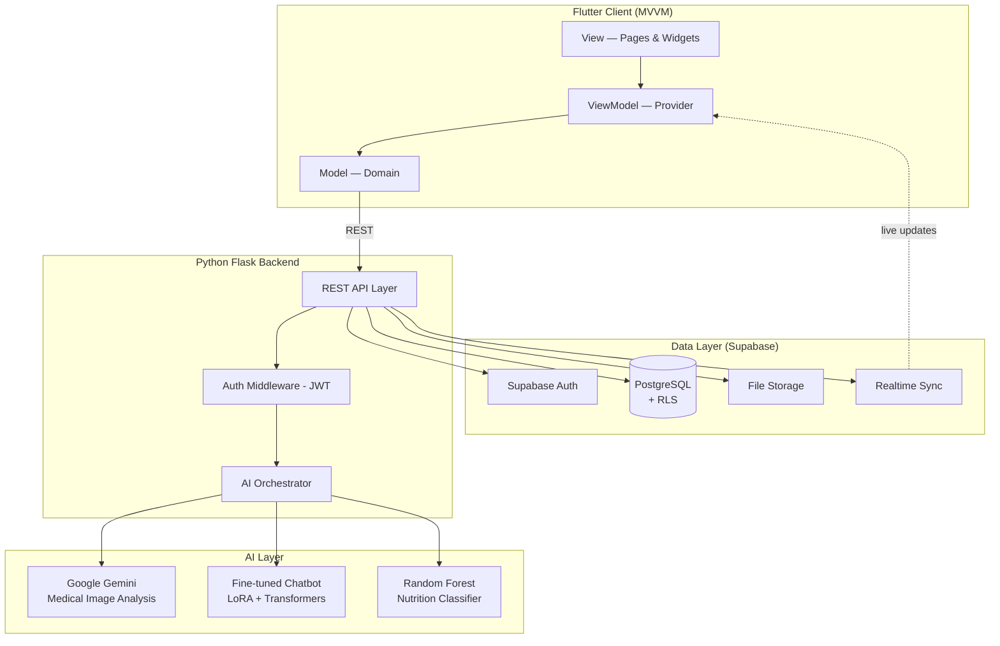

# 🌸 BloomBelly

### AI-assisted, Arabic-first maternal & child health platform

*A unified companion that organizes prenatal appointments, analyzes medical tests with AI, tracks fetal movements, evaluates nutrition, and includes a dedicated section for fathers to support their spouses throughout pregnancy.*

---

> [!NOTE]
> **This is a showcase repository.** The source code is private. This repository contains documentation, screenshots, architecture diagrams, and design references for our graduation project at **Al-Sham Private University (ASPU)** — Informatics Engineering College, 2026.

---

## 🎓 Academic Context

**Graduation project — Bachelor of Informatics Engineering**

- **University:** Al-Sham Private University (ASPU), Damascus, Syria
- **College:** Informatics Engineering
- **Academic Year:** 1447 AH / 2026 CE

**Project Team:**
- 🧑‍💻 **Mozn Jamous** — [@Mozn-jamous](https://github.com/Mozn-jamous)
- 🧑‍💻 **Shahd Bureghsh** — Co-founder & co-developer

**Supervisors:**
- 👩‍🏫 **Dr. Afaf Al-Shalabi** — Principal Supervisor
- 👩‍🏫 **Eng. Rahaf Abdul Qader** — Technical Co-supervisor

---

## 📖 The Problem

Pregnant women face overlapping daily challenges that current digital health apps don't address holistically — especially for Arabic-speaking users:

- **Fragmented information** — pregnant women jump across forums, search engines, and translated apps to find answers that often contradict each other
- **Disorganized appointments** — prenatal tests, lab results, and follow-ups live in paper notebooks or phone screenshots
- **Limited father involvement** — fathers want to help but lack a structured way to follow the pregnancy and offer real support
- **Generic nutrition advice** — recommendations rarely adapt to the mother's specific pregnancy stage or conditions like gestational diabetes or anemia
- **Unclear fetal movement tracking** — no localized, evidence-based guidance for when reduced movement is a red flag
- **The mother who also has a young child** carries a double load that no single app helps her manage

---

## ✨ The Solution

**BloomBelly** is a unified Flutter platform that brings together:

- 🤰 **Pregnancy tracking** — week-by-week development with stage-specific health and nutrition guidance
- 🔬 **AI-powered medical test analysis** — upload lab results or ultrasound images and receive simplified, accessible explanations
- 👣 **Evidence-based fetal movement tracking** — kick counter aligned with **ACOG's "Count the Kicks"** methodology
- 🥗 **Smart nutrition evaluation** — a Random Forest classifier evaluates meals against pregnancy-stage requirements
- 🤖 **Fine-tuned medical chatbot** — Arabic-aware Q&A trained on maternal/child health content via LoRA
- 👶 **Child care for second-time mothers** — vaccination schedules (based on **Syrian Ministry of Health** data), sleep quality analysis, WHO-aligned growth tracking
- 👨 **Dedicated father section** — simplified pregnancy stages, supportive guidance, first-aid awareness
- 🚨 **First aid guide** — emergency protocols for bleeding, preterm labor signs, fetal movement concerns
- 💳 **In-app wallet & paid services** — premium features (advanced chatbot, child-care services) managed via a doctor-administered wallet system

---

## 🧬 Evidence-Based Foundation

Every feature is grounded in peer-reviewed research:

| Feature | Scientific Basis |
|---|---|
| Kick counter | ACOG "Count the Kicks" (10 movements in 2 hours) |
| Risk awareness | Studies on reduced fetal movements & perinatal outcomes (PLOS, BJOG) |
| Nutrition guidance | WHO maternal nutrition guidelines |
| Sleep tracking | American Academy of Sleep Medicine pediatric recommendations |
| Vaccination schedule | Syrian Ministry of Health immunization protocols |
| Self-monitoring | PLOS ONE studies on digital health adherence |
| Father involvement | Frontiers in Public Health research on partner support |

Full bibliography available on request.

---

## 👥 User Roles

The system supports **4 distinct user types**, with **doctor-administered account creation** to ensure clinical oversight:

<table>
<tr>
<th>Role</th>
<th>Primary Responsibilities</th>
</tr>
<tr>
<td><b>🩺 Manager (Doctor/Admin)</b></td>
<td>Creates user accounts, manages wallet balances, activates/deactivates accounts, oversees the system</td>
</tr>
<tr>
<td><b>🤰 First-time Pregnant Mother</b></td>
<td>Weekly pregnancy tracking, kick counter, test uploads, nutrition logging, AI chatbot, first-aid access</td>
</tr>
<tr>
<td><b>👩‍👧 Pregnant Mother with a Child</b></td>
<td>All first-time features + child profile management, vaccination tracking, sleep analysis, WHO growth charts</td>
</tr>
<tr>
<td><b>👨 Father (Visitor)</b></td>
<td>Simplified pregnancy view, support guidance, first-aid awareness, dedicated chatbot for father questions</td>
</tr>
</table>

---

## 🏗️ Architecture (MVVM)

See [docs/architecture.md](docs/architecture.md) for full system breakdown, data flow, and AI pipeline.

---

## 🧰 Tech Stack

### Mobile (Frontend)
| Layer | Technology |
|---|---|
| Framework | Flutter / Dart |
| Architecture | MVVM (Model-View-ViewModel) |
| State Management | Provider |
| Routing | go_router |
| HTTP | http + REST clients |
| Local Storage | shared_preferences |
| Realtime | supabase_flutter |

### Backend (Python)
| Layer | Technology |
|---|---|
| Framework | **Flask** |
| Language | Python 3.x |
| Auth | JWT (JSON Web Tokens) |
| API Style | RESTful |

### AI / ML Stack
| Component | Technology |
|---|---|
| Medical image analysis | **Google Gemini API** |
| Chatbot core | **Fine-tuned transformer** (Hugging Face) |
| Tuning technique | **LoRA (Low-Rank Adaptation)** |
| ML framework | **PyTorch** |
| Nutrition classifier | **Random Forest** (scikit-learn) |
| Data processing | **Pandas + NumPy** |

### Database & Cloud
| Layer | Technology |
|---|---|
| Database | **Supabase** (PostgreSQL) |
| Auth provider | Supabase Auth + bcrypt hashing |
| Storage | Supabase Storage |
| Realtime | Supabase Realtime channels |

### DevOps
| Tool | Purpose |
|---|---|
| GitHub | Version control |
| Jira | Sprint planning & task tracking |
| Postman | API testing |
| Figma | UI/UX design |
| Telegram | Team coordination |

---

## 🎨 Design

Full design system, screen flows, and interactive prototype:

🔗 **[BloomBelly Figma — design & prototype](https://www.figma.com/design/dxpDoQBHXpv6tiysUVUpSA/BloomBelly?node-id=1-2&p=f&t=9jT9mGbWAKJmOGOh-0)**

---

## 🚀 Demo

> Demo assets coming as the project moves to public beta.

- 🎨 **Figma prototype:** [Open in Figma](https://www.figma.com/design/dxpDoQBHXpv6tiysUVUpSA/BloomBelly?node-id=1-2&p=f&t=9jT9mGbWAKJmOGOh-0)
- 🌐 Web demo: *coming soon*
- 📱 APK download: *coming soon*
- 🎥 Video walkthrough: *coming soon*

In the meantime, see [screenshots/](screenshots/) for visual previews.

---

## 📊 Project Scale

| Metric | Value |
|---|---|
| User roles | 4 (Manager, First-time mom, Mom-with-child, Father) |
| Core features | 12+ |
| Pages / screens | 30+ |
| Bilingual support | Arabic (RTL) + English |
| Scientific references | 17+ peer-reviewed studies |
| Test cases documented | 50+ (white-box + black-box) |

---

## 🛡️ Privacy & Compliance

- **JWT authentication** on every protected endpoint
- **bcrypt password hashing** — never stored as plaintext
- **Row Level Security** on Supabase tables
- **Doctor-administered account model** — no anonymous signups
- **Clear medical disclaimers** on all AI-generated content
- **PII redaction** on logs

---

## 🗺️ Roadmap

- [x] V1: MVP with all 4 user roles & core features
- [x] V1.1: AI medical image analysis (Gemini)
- [x] V1.2: Fine-tuned chatbot (LoRA)
- [x] V1.3: Nutrition classifier (Random Forest)
- [ ] V2: Public beta with App Store + Play Store release
- [ ] V2.1: Contraction timer & breastfeeding tracker
- [ ] V2.2: Direct clinic integration
- [ ] V2.3: Anonymized data export for research

See [TIMELINE.md](TIMELINE.md) for the full development history and post-graduation roadmap.

---

## 📚 Project Documentation

This repository contains a complete documentation set:

| Document | Audience | Purpose |
|---|---|---|
| [Architecture](docs/architecture.md) | Engineers | System design, AI pipeline, sequence diagrams |
| [Tech Stack](docs/tech-stack.md) | Engineers | Full technology breakdown with rationale |
| [Engineering Decisions (ADRs)](docs/ENGINEERING-DECISIONS.md) | Senior Engineers | 10 documented architectural decisions |
| [Research References](docs/RESEARCH-REFERENCES.md) | Academic Reviewers | Full bibliography (17+ sources) |
| [Case Study](case-study.md) | All | Problem, approach, outcome, lessons learned |
| [Impact & Theory of Change](IMPACT.md) | Grant Reviewers | SDG alignment, outcome metrics, target programs |
| [Business Model](BUSINESS-MODEL.md) | Accelerators / Investors | Revenue streams, market, unit economics |
| [Timeline](TIMELINE.md) | All | Project milestones and post-graduation plan |
| [Contributors](CONTRIBUTORS.md) | All | Authors, supervisors, stakeholders |
| [Security Policy](SECURITY.md) | Engineers / Auditors | Disclosure process, security practices |
| [Citation (CFF)](CITATION.cff) | Researchers | Machine-readable academic citation |

---

## 👥 Team Contributions

This project was developed jointly by **Mozn Jamous** and **Shahd Bureghsh** as our graduation project at ASPU, with shared responsibilities across:

- Stakeholder interviews (mothers, fathers, OB/GYN, pediatricians, nutritionists)
- System design (MVVM, data modeling, ERD)
- Flutter implementation (UI, state, navigation)
- Flask backend & API design
- AI integration (Gemini, LoRA, Random Forest)
- Supabase schema & RLS policies
- Test cases (black-box & white-box) — see project documentation
- Final thesis and defense

---

## 📬 Contact

- **Email:** moznjamous9@gmail.com
- **GitHub:** [@Mozn-jamous](https://github.com/Mozn-jamous)
- **LinkedIn:** [Mozn Jamous](https://www.linkedin.com/in/mozn-jamous)

For partnership opportunities, grant collaborations, accelerator interest, or technical inquiries, please reach out directly. We are particularly interested in:
- Maternal/child health organizations and NGOs
- Digital health accelerators targeting MENA
- Research institutions working on Arabic-language clinical content
- Investors aligned with social-impact health tech

---

## 📄 License

This repository and all its contents are © 2026 Mozn Jamous & Shahd Bureghsh. **All rights reserved.** See [LICENSE](LICENSE).

The source code is private. The work has been formally submitted as a graduation thesis to Al-Sham Private University and is under the academic supervision of Dr. Afaf Al-Shalabi and Eng. Rahaf Abdul Qader.

---

*Built with care, in Damascus.* 🇸🇾

