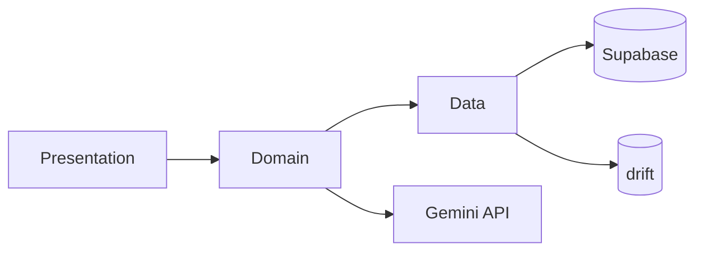
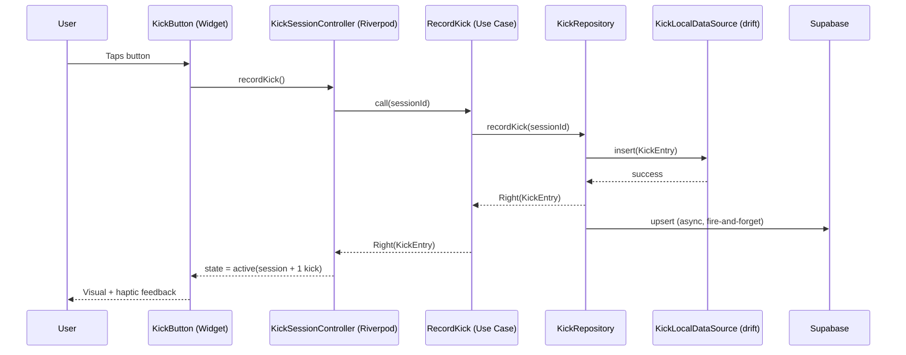
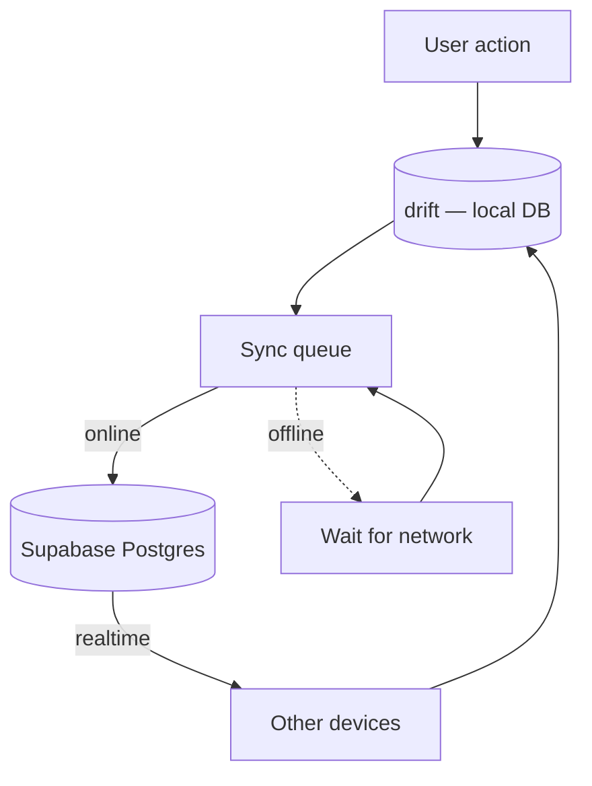
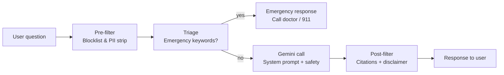

# BloomBelly — Architecture

This document describes the high-level architecture, design decisions, and data flows of BloomBelly.

## Table of Contents
- [Architectural Style](#architectural-style)
- [Layer Responsibilities](#layer-responsibilities)
- [Folder Structure](#folder-structure)
- [Data Flow](#data-flow)
- [Sync Strategy](#sync-strategy)
- [AI Safety Pipeline](#ai-safety-pipeline)
- [Security & Privacy](#security--privacy)
- [Architectural Decision Records](#architectural-decision-records)

---

## Architectural Style

BloomBelly follows a **Clean Architecture** approach simplified for a solo Flutter codebase. We separate concerns into three layers — Presentation, Domain, and Data — to keep business logic testable and independent of UI or storage details.



**Why this style?**
- Use cases are pure Dart → easy to unit test.
- Repositories abstract data sources → switch from Supabase to anything else without touching pages.
- Presentation layer is thin → reduces widget bugs.

---

## Layer Responsibilities

### Presentation
- Pages, widgets, and Riverpod controllers.
- Renders state; never calls Supabase or drift directly.
- Knows nothing about JSON, SQL, or REST.

### Domain
- Entities (`KickEntry`, `PregnancyJournal`, `Vaccine`, ...).
- Use cases (`RecordKick`, `AnalyzePregnancyWeek`, `ScheduleVaccine`, ...).
- Abstract repository interfaces.
- Pure Dart, no Flutter import.

### Data
- Concrete repositories implementing the Domain interfaces.
- DataSources: `KickLocalDataSource` (drift), `KickRemoteDataSource` (Supabase).
- DTOs (`@freezed`) with JSON serialization for the wire.
- Mappers that translate DTO ↔ Entity ↔ drift companion.

---

## Folder Structure

```
lib/
├── core/
│   ├── theme/          # AppColors, AppTypography, AppSpacing, AppTheme
│   ├── router/         # GoRouter config, route names, guards
│   ├── di/             # Root Riverpod providers
│   ├── network/        # Supabase client wrapper
│   ├── storage/        # drift database + tables + DAOs
│   ├── errors/         # Sealed Failure, exceptions
│   └── utils/          # Result, extensions, logger
├── features/
│   ├── kick_counter/
│   │   ├── data/       # DTOs, datasources, mappers, repo impl
│   │   ├── domain/     # Entities, repository interface, use cases
│   │   └── presentation/  # Controllers, pages, widgets
│   ├── pregnancy_journal/
│   ├── ai_chat/
│   ├── vaccines/
│   ├── child_growth/
│   ├── risk_screening/      # in development
│   └── auth/
├── shared/             # Reusable widgets and extensions
└── main.dart
```

---

## Data Flow

A typical user action (e.g. "record a kick"):



**Key property:** the user sees feedback the instant drift confirms locally; the Supabase sync happens in the background and never blocks the UI.

---

## Sync Strategy

BloomBelly is **local-first**:

1. Every write is committed to drift first.
2. A background queue forwards the change to Supabase.
3. If the device is offline, the queue persists until connection returns.
4. Conflicts are resolved by *Last-Write-Wins* on per-field basis (with deletes ordered by tombstone timestamps).



---

## AI Safety Pipeline

The Gemini integration passes every user query through a 4-stage pipeline before responding:



**System prompt** anchors Gemini to:
- Answer only within maternal/child health scope
- Always cite a source (WHO / Mayo Clinic / ACOG)
- Never give specific drug dosages
- Always append a medical disclaimer

---

## Security & Privacy

| Concern | Mitigation |
|---|---|
| Unauthorized data access | Supabase Row-Level Security: every row scoped to `auth.uid()` |
| Sensitive data at rest | Supabase encrypts at rest; sensitive fields additionally encrypted client-side (planned) |
| Token leakage | Tokens stored in platform secure storage (`flutter_secure_storage`) |
| AI hallucinations | Safety layer + citations + disclaimers |
| GDPR right to erasure | Full account deletion via Supabase RPC; cascading FKs |
| GDPR right to portability | JSON export of all user data |

---

## Architectural Decision Records

Notable decisions documented inline in [decisions.md](decisions.md):

- **ADR-001:** Adopt Riverpod over Provider for state management
- **ADR-002:** Use drift (SQL) over Hive (NoSQL) for relational data
- **ADR-003:** Local-first architecture with background sync
- **ADR-004:** Sealed `Failure` for typed error handling
- **ADR-005:** Strangler Fig refactor instead of full rewrite
- **ADR-006:** Bilingual content via flutter_localizations (not Crowdin)
