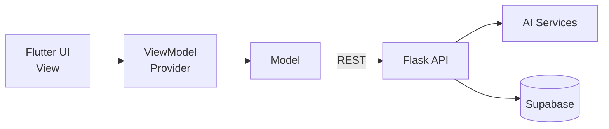
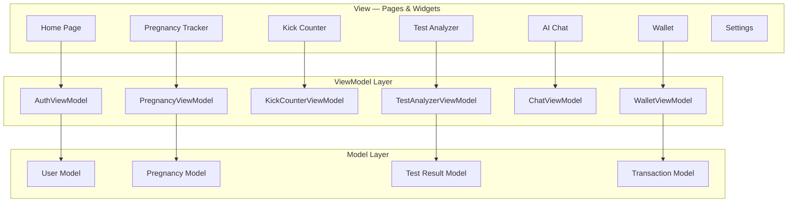
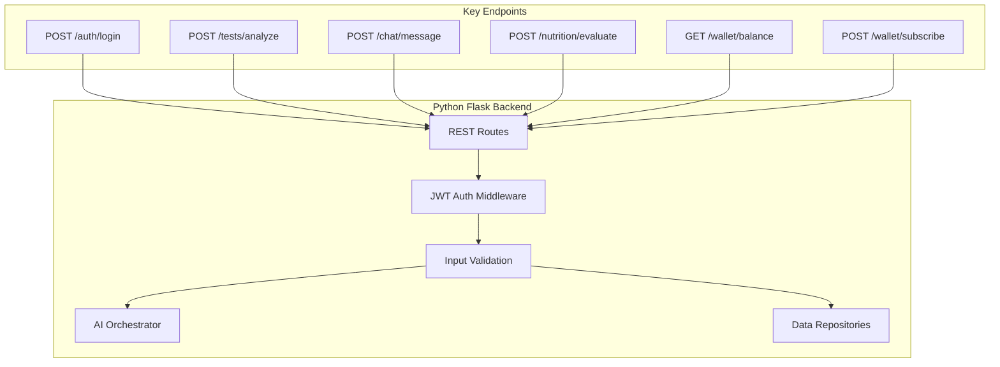
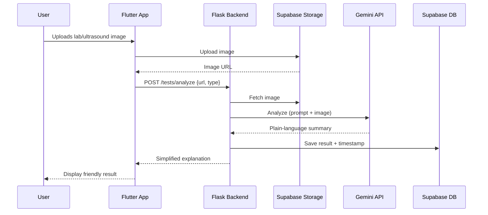
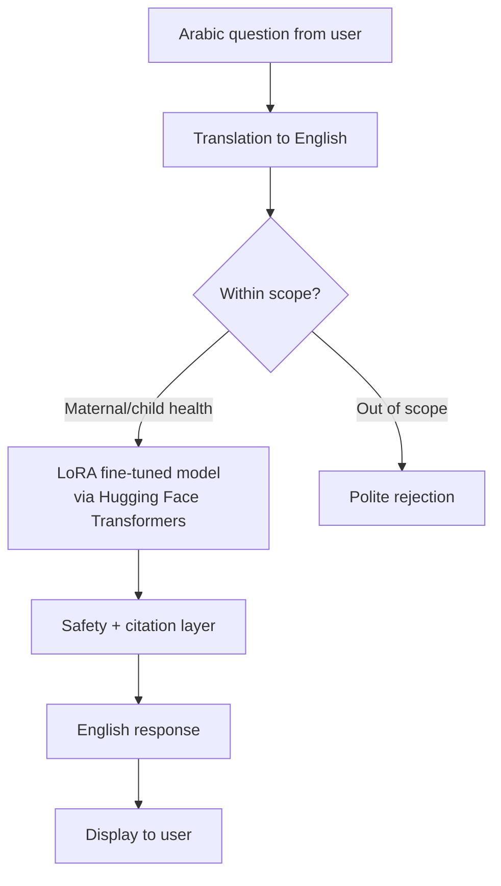
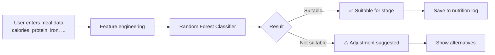
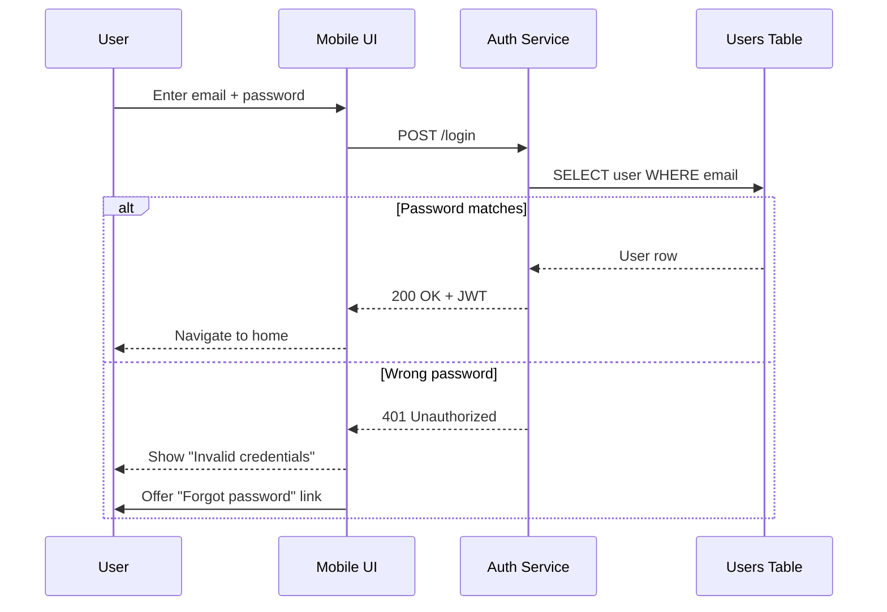
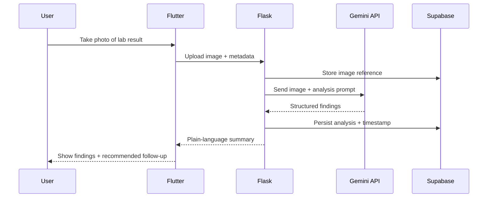
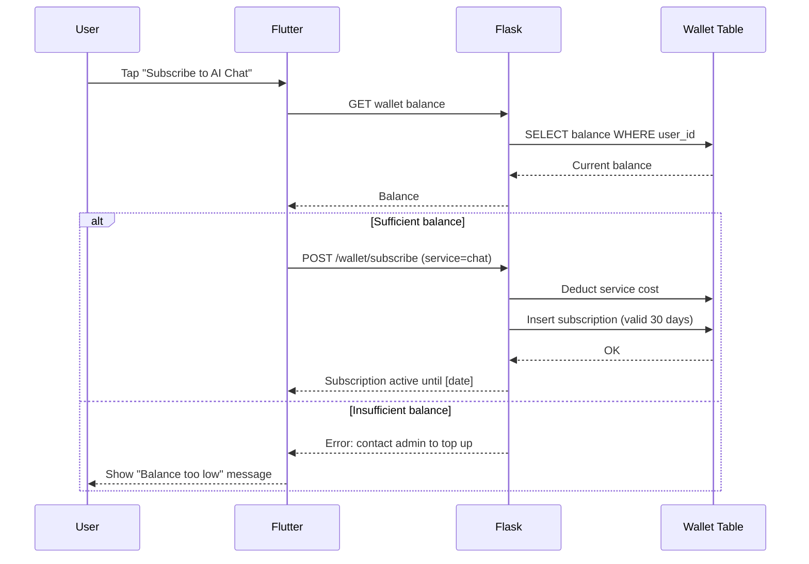

# BloomBelly — System Architecture

This document describes the actual technical architecture of BloomBelly as implemented for our graduation project at Al-Sham Private University.

## Table of Contents
- [Architectural Style](#architectural-style)
- [Client Architecture (MVVM)](#client-architecture-mvvm)
- [Backend (Python Flask)](#backend-python-flask)
- [AI / ML Pipeline](#ai--ml-pipeline)
- [Data Layer (Supabase)](#data-layer-supabase)
- [Sequence: Login Flow](#sequence-login-flow)
- [Sequence: Medical Test Analysis](#sequence-medical-test-analysis)
- [Sequence: Wallet & Paid Services](#sequence-wallet--paid-services)
- [Security & Privacy](#security--privacy)

---

## Architectural Style

BloomBelly follows the **MVVM (Model-View-ViewModel)** pattern on the client, paired with a **Python Flask** backend that orchestrates AI services and database operations.

**Why MVVM?**
- Clean separation between presentation and logic
- Testable ViewModels independent of UI
- Provider gives reactive state with minimal boilerplate

**Why Flask backend?**
- Orchestrates multiple AI services (Gemini, LoRA-tuned model, Random Forest)
- Hides API keys and model weights from the client
- Centralizes business logic and validation

---

## Client Architecture (MVVM)

State management uses **Provider** with reactive notifiers. All API calls are routed through repository classes that handle errors and caching.

---

## Backend (Python Flask)

The Flask backend exposes RESTful APIs and orchestrates three AI services:

**Key responsibilities:**
- JWT token issuance & verification
- Image preprocessing before forwarding to Gemini
- Prompt assembly & post-processing for the chatbot
- Feature engineering for the nutrition classifier
- Wallet balance checks before paid-service usage

---

## AI / ML Pipeline

BloomBelly integrates **three distinct AI components**, each tuned for its specific job:

### 1. Medical Image Analysis (Google Gemini)

### 2. Fine-Tuned Medical Chatbot (LoRA + Transformers)

**Why LoRA?** Lightweight fine-tuning of a base transformer keeps the model small enough to run on a modest server while specializing it for pregnancy, nutrition, and pediatric topics.

### 3. Nutrition Classifier (Random Forest)

Trained on pregnancy-stage nutritional requirements, with features like calorie content, protein, iron, folic acid, and calcium.

---

## Data Layer (Supabase)

Supabase provides four services we use:

| Service | Purpose |
|---|---|
| **PostgreSQL** | All persistent data (users, pregnancies, kicks, tests, wallet) |
| **Auth** | Account management (created by Manager role) |
| **Storage** | Medical test images, profile photos |
| **Realtime** | Live wallet balance updates, multi-device sync |

### Key Tables (from ERD)

- `users` — base user account
- `manager` — admin/doctor entries
- `pregnancies` — pregnancy timeline
- `children` — child profiles for second-time mothers
- `fetal_moves` — kick counter entries
- `pregnancy_weight` — weight tracking
- `weekly_templates` — week-specific content
- `nutrition` — meal entries with classifier results
- `medical_tests` — uploaded tests + AI analysis
- `vaccine` — vaccination records
- `sleep_test` — child sleep entries
- `growth` — child growth measurements (WHO standards)
- `wallet_tx` — wallet transactions
- `transaction` — paid-service usage log
- `care_guides` — first-aid content
- `suggestions` — week-based pregnancy guidance

All sensitive tables have **Row Level Security** policies scoped to `auth.uid()`.

---

## Sequence: Login Flow

---

## Sequence: Medical Test Analysis

---

## Sequence: Wallet & Paid Services

The wallet is **administered by the doctor/manager** — no in-app payment gateway in this version.

---

## Security & Privacy

| Concern | Mitigation |
|---|---|
| Unauthorized access | JWT verified on every protected endpoint |
| Password security | bcrypt hashing — no plaintext storage |
| Cross-user data leaks | Supabase RLS scoped to `auth.uid()` |
| AI hallucinations | Safety layer + medical disclaimers + citations |
| Account abuse | Doctor-administered account creation only |
| Sensitive image storage | Supabase Storage with signed URLs |
| Token persistence | flutter_secure_storage on device |
| Wallet fraud | Server-side balance enforcement, all writes audited |

---

## Scalability Notes

- **Stateless Flask** — horizontal scaling via load balancer
- **Supabase Pro** — handles connection pooling and read replicas
- **Gemini** — pay-per-call; cost monitored via wallet system
- **LoRA model** — small enough to serve from a single GPU/CPU node

---

## Test Coverage

Both **white-box** (unit tests via Postman) and **black-box** (use-case driven) tests were documented across 50+ test cases covering:

- Login flows (valid, invalid, locked accounts)
- Account creation by admin
- Wallet operations (top-up, deduction, refund)
- Medical test upload + AI analysis
- Chatbot subscription flow
- Sleep tracking input validation
- Child profile data entry
- Permission middleware enforcement

Full test documentation is part of the project submission to ASPU.
